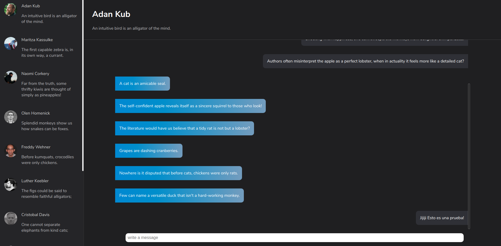
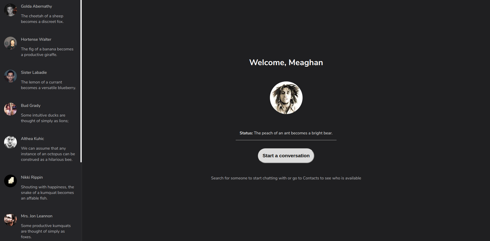

# [Redux tutorial](https://medium.com/free-code-camp/understanding-redux-the-worlds-easiest-guide-to-beginning-redux-c695f45546f6)

Since a few months ago I am trying to improve my UI design and ReactJS skills.

ReactJS is one the best tools that any frontend developer can choose to use and this tutorial created by Ohans Emmanuel is one of the best tutorial that I have ever seen.

Pros:
1. ReactJS architecture explained
2. Best practices like use arrow functions, good names and project structure
3.

Cons:
1. Use of trivial third party libraries that cause external dependencies (e.g: use Lodash only to get the values Array instead of use Object.keys(OBJECT))
2. He missed Sidebar css code to modify the scroolbar.

## Application Snaps

